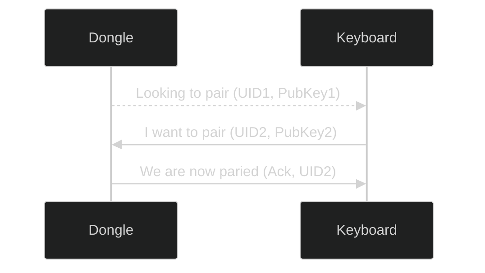
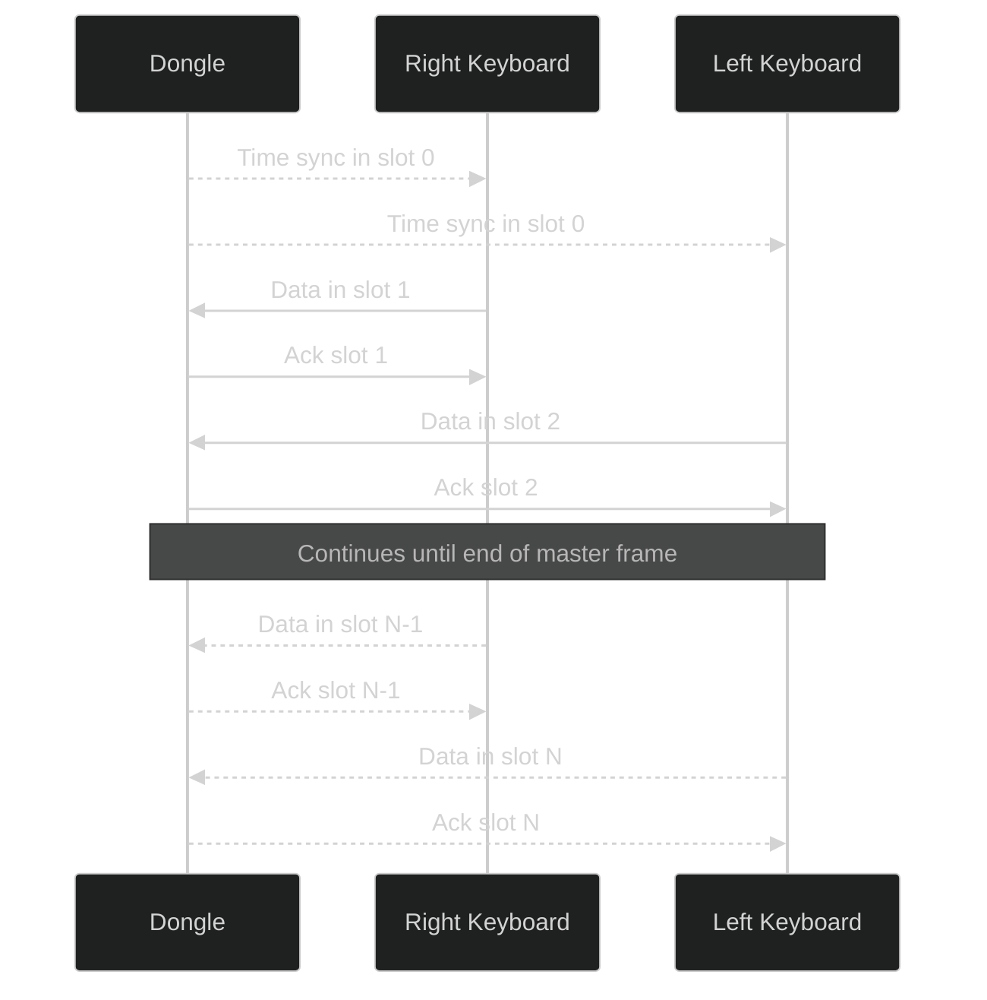

# Chapter 1

## Dongle / Keyboard paring

```mermaid
%%{init: {'theme':'dark'}}%%
sequenceDiagram
    Dongle-->>Keyboard: Looking to pair (UID1, PubKey1)
    Keyboard->>Dongle: I want to pair (UID2, PubKey2)
    Dongle->>Keyboard: We are now paried (Ack, UID2)
```

## Dongle / Keyboards data transfers

```mermaid
%%{init: {'theme':'dark'}}%%
sequenceDiagram
    Dongle-->>Right Keyboard: Time sync in slot 0
    Dongle-->>Left Keyboard: Time sync in slot 0
    Right Keyboard->>Dongle: Data in slot 1
    Dongle->>Right Keyboard: Ack slot 1
    Left Keyboard->>Dongle: Data in slot 2
    Dongle->>Left Keyboard: Ack slot 2
Note over Left Keyboard, Dongle: Continues until end of master frame
    Right Keyboard-->>Dongle: Data in slot N-1
    Dongle-->>Right Keyboard: Ack slot N-1
    Left Keyboard-->>Dongle: Data in slot N
    Dongle-->>Left Keyboard: Ack slot N
```